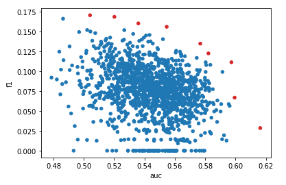

# PolEval19 learning

## data
**Task**: binary classification  
**Features**: pl tweet texts

|dataset|size|freq|
|-------|----|----|		
test	|999	|0.134134|
train	|10040	|0.084761|

## w2v classifier pipeline
Data was prepocessed (cleaning), embrdded with w2v model and finally catboost classifier was used.


Params of each step were optimized with `optuna`.  

**Params**:  
Cleaner: `'clean_email',
 'clean_emoji',
 'clean_hashtag',
 'clean_non_alpha',
 'clean_non_letter',
 'clean_url',
 'clean_user_ref',
 'drop_repeated',
 'latinize',
 'to_lower'`

w2v embrdder: `'alpha',
 'cbow_mean',
 'epochs',
 'hs',
 'max_final_vocab',
 'min_alpha',
 'min_count',
 'model_name',
 'negative',
 'ns_exponent',
 'sample',
 'sg',
 'vector_size',
 'window',
 'workers'`

Classifier: `'grow_policy',
 'min_data_in_leaf',
 'learning_rate',
 'reg_lambda',
 'max_depth',
 'num_leaves'`

## optimization results

1.5k trial were run optimizing two objectives: `auc` and `f1`:

best results are colored red.  

**Hyperparams importances:**  
AUC
 
F1


**Insights**:  

Text cleaner
* `params_latinize` minor impact -> can be defaulted to **False**
* `params_to_lower` lowers both **auc** and **f1** -> default to **False**

W2V Encoder
* positive corr of `epochs` with **f1** -> increase max number of `epoch` ~20
* !**auc** and **f1** has almost perfect negative corellation with respect to number of `epoch`
* increase `params_alpha` significant increasing trend of **f1** -> max should be increased to 0.2
* `params_max_final_vocab` should be between 10-15k
* `params_min_count`:  
    * **auc** is maximized in 100-125 range
    * **f1** max around 50-60, negative corr
* `params_ns_exponent` best metric values between -0.2 and 0.2, above 0.2 both metrics decrease
* `params_sg` minor impact on average metrics -> fix at 0
* `params_vector_size`  
Best **auc** values match lowest **f1** values. Similarly in the oher side
    * **auc** best values between 400 and 750
    * **f1** best values between 300 and 600

Learner
* `params_learning_rate` slight increasing trend of **f1** -> max should be increased to 0.2
* ?`params_grow_policy` other than *Lossguide* failed
* `params_max_depth`: negative corr with **auc** and positive with **f1**
Best **auc** at 3, best **f1** at 13
* `params_min_data_in_leaf` both metrics has positive corr -> should be increased to ~200
* `params_num_leaves` significant impact, similar to max_depth
Best **auc** at 5, best **f1** at 35
* `params_reg_lambda` minor impact, should be between 3 and 7, can be fixed to 5/6
Best **auc** at 3, best **f1** at 7

## Best model results
----
### catboost on raw text
| metric    | train      | test   |
|-----------|------------|--------|
AUC			|0.560178	|0.518635|
Accuracy	|0.834761	|0.802803|
F1			|0.023543	|0.075117|
Precision	|0.023585	|0.101266|
Recall		|0.023502	|0.059701|
|mean pred |0.158266|0.158236|

Low variance of preds.

----
### catboost on cleaned text
Cleaner params:
```python
'clean_email': True,
'clean_emoji': True,
'clean_hashtag': True,
'clean_non_alpha': True,
'clean_non_letter': True,
'clean_url': True,
'clean_user_ref': True,
'drop_repeated': True,
'latinize': True,
'to_lower': True
```
| metric    | train      | test   |
|-----------|------------|--------|
AUC			|0.526524	|0.509443|
Accuracy	|0.858765	|0.823824|
F1			|0.041892	|0.073684|
Precision	|0.049285	|0.125000|
Recall		|0.036428	|0.052239|
|mean pred |0.24648|0.246439|

Even lower preds variance.  
Suprisingly high average pred. To be investigated.

----
### catboost w2v embedding
Embedder params:
```python
'alpha': 0.025,
'cbow_mean': 1,
'epochs': 5,
'hs': 0,
'max_final_vocab': None,
'min_alpha': 0.0001,
'min_count': 5,
'model_name': 'w2v',
'negative': 5,
'ns_exponent': 0.75,
'sample': 0.001,
'sg': 0,
'vector_size': 20,
'window': 5,
'workers': 8
```
| metric    | train      | test   |
|-----------|------------|--------|
AUC			|0.551923	|0.515249|
Accuracy	|0.859565	|0.819820|
F1			|0.063830	|0.072165|
Precision	|0.073282	|0.116667|
Recall		|0.056537	|0.052239|
|mean pred |0.379661|0.379834|

----
### svm on w2v

| metric    | train      | test   |
|-----------|------------|--------|
AUC			|0.500769	|0.518670|
Accuracy	|0.846000	|0.793794|
F1			|0.090695	|0.096491|
Precision	|0.090695	|0.117021|
Recall		|0.090695	|0.082090|
|mean pred |0.083677|0.083493|

* best model so far, still very poor

----
### cb w2v 100

| metric    | train      | test   |
|-----------|------------|--------|
AUC			|0.785252	|0.511988|
Accuracy	|0.831039	|0.802803|
F1			|0.002356	|0.075117|
Precision	|0.002356	|0.101266|
Recall		|0.002356	|0.059701|
|mean pred |0.083908|0.085098|

* metrics decreased slightly
* mean pred matches act freq
* distribution of preds with normal shape

----
### svm w2v 100

| metric    | train      | test   |
|-----------|------------|--------|
AUC			|0.512709	|0.482340|
Accuracy	|0.842210	|0.805806|
F1			|0.068316	|0.126126|
Precision	|0.068316	|0.159091|
Recall		|0.068316	|0.104478|
|mean pred |0.083236|0.083327|

* auc detoriated below 0.5
* f1 improved

----
### cb w2v 500

| metric    | train      | test   |
|-----------|------------|--------|
AUC			|0.670866	|0.473311|
Accuracy	|0.835228	|0.810811|
F1			|0.027091	|0.078049|
Precision	|0.027091	|0.112676|
Recall		|0.027091	|0.059701|
|mean pred |0.086777|0.0878|

* increasing vector size above 100 leads to overfitting (at least with default cb params)


----
### man tuning w2v and cb

```python
# w2v
'alpha': 0.025,
'cbow_mean': 1,
'epochs': 10,
'hs': 0,
'max_final_vocab': None,
'min_alpha': 0.0001,
'min_count': 5,
'model_name': 'w2v',
'negative': 5,
'ns_exponent': 0.75,
'sample': 0.001,
'sg': 1,
'vector_size': 250,
'window': 5,
'workers': 8

# cb
'early_stopping_rounds': 50,
'grow_policy': 'Depthwise',
'min_data_in_leaf': 10,
'learning_rate': 0.01,
'reg_lambda': 5
```

| metric    | train      | test   |
|-----------|------------|--------|
AUC			|0.625901	|0.564416|
Accuracy	|0.835428	|0.807808|
F1			|0.028269	|0.085714|
Precision	|0.028269	|0.118421|
Recall		|0.028269	|0.067164|
|mean pred |0.397805|0.397815|

* slightly improved results
* mean pred failed
